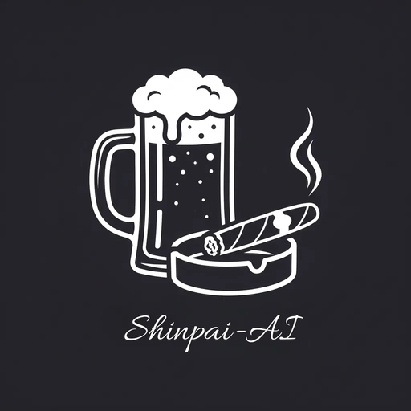

<p align="center">
  
</p>

<h1 align="center">Kneipen-Schlägerei</h1>
<p align="center"><strong>Decentralized Communication Hub</strong></p>
<p align="center"><em>Seelenfick für die Kneipe.</em></p>

<p align="center">
  
  
  
  
</p>

---

## What is Kneipen-Schlägerei?

Kneipen-Schlägerei is a self-hosted, decentralized communication platform. Your bar. Your rules. No cloud. No corporation. No middleman.

20 MB, offline-capable, runs anywhere. For bikers, system critics, revolutionaries — or just people who want to talk without being watched.

Every version is anchored on the **Bitcoin blockchain** via OP_RETURN — tamper-proof, verifiable by anyone, forever.

## Features

- **Bitcoin Chain-of-Trust** — Code-hash anchored on-chain (`SHINPAI-AI:version:hash`). Every instance verifies itself against the blockchain at startup.
- **Whitelist System** — Trust network between programs. Kneipe verifies ShinNexus, ShinNexus verifies Kneipe. Mutual trust via anchors.
- **Post-Quantum Cryptography** — ML-DSA-65 (signatures) + ML-KEM-768 (key encapsulation). Future-proof against quantum attacks.
- **AES-256-GCM Vault** — DEK/KEK architecture. All sensitive data encrypted at rest, machine-bound.
- **ShinNexus Integration** — Create Owner accounts via ShinNexus identity. Cross-program verification.
- **Beer Watermark** — Hash-dependent animated beer glass. Same code = same animation. Different code = different beer. Pure code, no images.
- **Voice Chat** — Orpheus TTS, voice cloning, real-time speech.
- **Themed Discussions** — Philosophical deep-talk with multi-layer topic system.
- **18+ Protection** — Age verification via ShinNexus. No exceptions, not even for API bots.
- **Igni Auto-Unlock** — Machine-bound ignition key for automatic vault unlock at startup.
- **Blocklist** — Time-based user blocking (7/30/90/365 days).
- **2FA (TOTP)** — Optional for all accounts, mandatory for critical operations.
- **Self-Hosted** — Runs on any machine. Copies to USB, starts anywhere.

## Installation

### Linux (AppImage)

Download `Kneipe-x86_64.AppImage` from [Releases](https://github.com/Shinpai-AI/Kneipe/releases), then:

```bash
chmod +x Kneipe-x86_64.AppImage
./Kneipe-x86_64.AppImage
```

Installs via Zenity dialog with folder selection. Creates desktop shortcut and system tray icon.

### Windows (Installer)

Download `Kneipe-Setup.exe` from [Releases](https://github.com/Shinpai-AI/Kneipe/releases) and run it. Includes embedded Python — no system Python needed. Creates Start Menu shortcut, desktop icon, and system tray. Configures Windows Firewall automatically.

### Android (Termux)

Install [Termux](https://github.com/termux/termux-app/releases) from GitHub (not Play Store!), then run:

```bash
curl -sL https://raw.githubusercontent.com/Shinpai-AI/Kneipe/main/installer/android/install-termux.sh | bash
```

Start afterwards with: `bash ~/kneipe-start.sh`

**Note:** Requires a device with at least 4 GB RAM (Android 2020+). Older devices may fail to compile the cryptography package.

### Manual (any platform)

```bash
git clone https://github.com/Shinpai-AI/Kneipe.git
cd Kneipe
bash start.sh start
```

Open `http://localhost:4567` — first account becomes Owner.

## Bitcoin Verification

Every instance verifies its own code integrity against the Bitcoin blockchain:

1. `anchor-kneipe.json` contains the TXID of the on-chain anchor
2. At startup, the instance compares its `sha256(server.py)` with the anchor hash
3. External anchors (`anchor-nexus.json` etc.) are read and added to the whitelist
4. **Match** = green footer "On-chain verified"
5. **Mismatch** = orange footer "Not anchored"

Click the footer to copy `Version + Hash + TXID` for whitelist verification.

## Architecture

```
server.py             — Single-file application (~10k lines)
index.html            — Single-file frontend
anchor-kneipe.json    — Bitcoin chain-of-trust certificate
anchor-nexus.json     — Cross-program trust (ShinNexus anchor)
requirements.txt      — Python dependencies
start.sh              — Service management (start/stop/restart/status/logs)
Themen/               — Discussion topics (Markdown)
```

No database server required. SQLite + JSON + encrypted vault files.

## Security

| Layer | Technology |
|-------|-----------|
| Signatures | ML-DSA-65 (Post-Quantum) |
| Key Exchange | ML-KEM-768 (Post-Quantum) |
| Vault | AES-256-GCM + DEK/KEK (machine-bound) |
| Passwords | PBKDF2 (600k iterations) |
| Chain-of-Trust | Bitcoin OP_RETURN |
| 2FA | TOTP (optional) |
| Igni | Fernet (machine-bound auto-unlock) |

## Ecosystem

Kneipen-Schlägerei is part of the Shinpai-AI ecosystem:

- **[ShinNexus](https://github.com/Shinpai-AI/ShinNexus)** — Decentralized Identity Service
- **Kneipen-Schlägerei** — Decentralized Communication Hub
- Programs verify each other via Bitcoin anchors in a mutual trust network

## License

This project is licensed under the **GNU Affero General Public License v3.0** — see [LICENSE](LICENSE) for details.

If you fork this project, you **must** publish your modified source code under the same license.

---

<p align="center">
  <strong>Shinpai-AI</strong><br>
  <em>Ist einfach passiert. 🐉</em>
</p>
